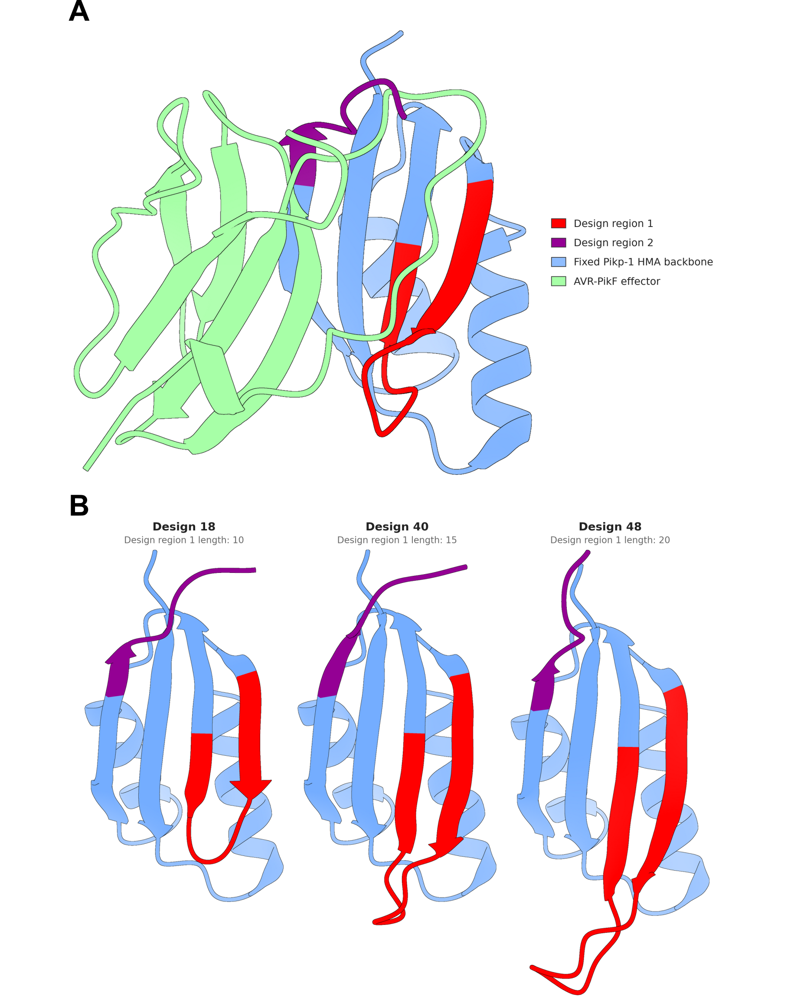

Date: 31/8/26

RFdiffusion inpainting rebuilt two regions of the Pikp-1 HMA and left the rest
of the scaffold intact. Design region 1 was sampled at 10 to 20 residues
against a wild-type length of 13, and design region 2 was fixed at 6 residues,
giving the region spec `10-20|6-6`. Design region 1 is internal, flanked by
fixed scaffold at both ends. Design region 2 is the final 6 residues of the
receptor, so it is anchored at one end only.

This asks how far the retained scaffold constrained the rebuilt backbones.

Regenerate with:

```bash
cd analyses/01-design-region-backbones
ChimeraX --exit --nogui --script dssp_extract.py
python3 design_region_summary.py
python3 structural_correspondence_extract.py
```

Secondary structure is assigned by the DSSP implementation in ChimeraX, run on
the 64 RFdiffusion backbones and on the wild-type reference through the same
call. The RFdiffusion outputs carry N, CA, C and O, so strand assignment is
computed from backbone hydrogen bonds rather than from geometry by hand.

An earlier pass used pydssp 0.9.1 instead, in a script that was never
committed, and reported 57 designs with a two-residue strand at design region
2. pydssp implements only the backbone hydrogen-bond term and emits three
states. It disagrees with ChimeraX on whether a third residue at the strand
edge counts, which is 11 designs against 4. Everything below is the ChimeraX
assignment.

```{python}
from pathlib import Path
import collections
import pandas as pd

HERE = Path.cwd()
if not (HERE / "design_region_summary.csv").exists():
    HERE = Path("analyses/01-design-region-backbones")

summary = pd.read_csv(HERE / "design_region_summary.csv")
summary.head(10)
```

## Design region 1 keeps both strands

```{python}
band = pd.cut(summary.dr1_length, [9, 12, 15, 17, 20],
              labels=["10-12", "13-15", "16-17", "18-20"])
(summary.groupby(band, observed=True)
 .agg(designs=("dr1_length", "size"),
      median_strand=("dr1_strand_residues", "median"),
      min_strand=("dr1_strand_residues", "min"),
      max_strand=("dr1_strand_residues", "max"),
      always_two_segments=("dr1_strand_segments", lambda s: bool((s == 2).all()))))
```

- All 64 designs rebuilt design region 1 as exactly two strand segments, the
  same topology as the wild type (`SSSSSCCCCCSSS`).
- Median strand content rises from 7 residues in the shortest designs to 13 in
  the longest, so the sampled length is absorbed by extending the strands
  rather than by adding loop.

## Design region 2 reproduces the wild-type C terminus

```{python}
counts = (summary.dr2_pattern.value_counts()
          .rename_axis("pattern").reset_index(name="designs"))
counts["matches_wild_type"] = counts.pattern == "SSCCCC"
counts
```

- The wild-type C terminus is `SSCCCC`, two residues of strand then a
  four-residue disordered tail.
- 51 of 64 designs reproduce it exactly. 11 carry a third strand residue, one
  carries a single strand residue, and one is entirely coil.

## Where the added length lands

```{python}
corr = pd.read_csv(HERE / "structural_correspondence.csv")
corr[["design_position", "n_designs", "n_matched",
      "n_inserted", "frac_inserted", "median_dist"]]
```

- Each design region 1 residue is matched to a wild-type residue by structure
  after superimposing on the fixed N-terminal block. Residues with no
  wild-type counterpart within the cutoff are the extension.
- Positions 1 to 5 match the wild type in every design, and insertions
  concentrate at positions 6 to 11, which is the turn of the hairpin.

## Thesis figure

{width="100%"}

- Panels are rendered by `render_design_regions.cxc` and composed by
  `build_design_region_figure.py`.
- ChimeraX cannot save images under `--nogui` on macOS, so the render step
  needs the GUI. The rendered panels are kept in `renders/` so the figure can
  be rebuilt without re-rendering.
