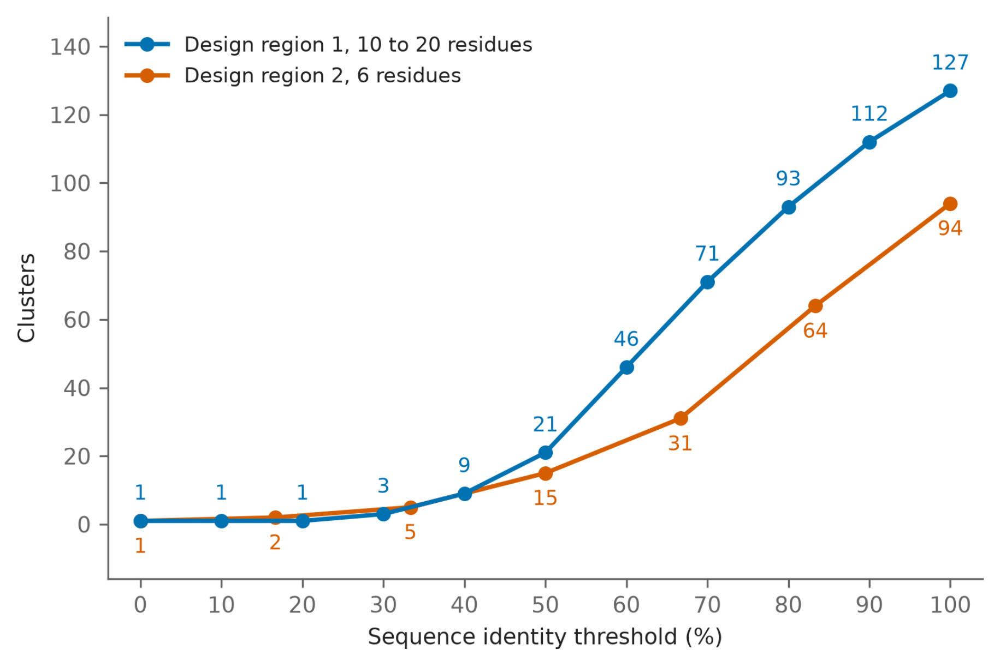
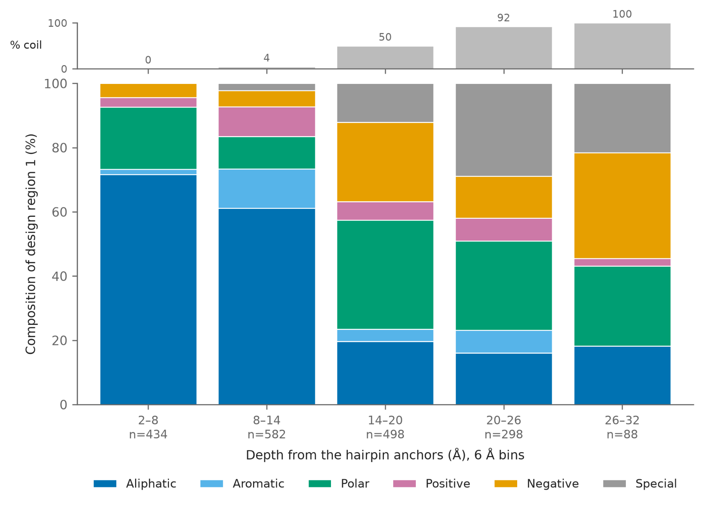

Date: 31/8/26

RFdiffusion rebuilt the two design regions as backbones only, so ProteinMPNN
designed sequences for them. Two sequences were generated per backbone, giving
128 sequences from 64 backbones. This asks two things. How much sequence
variety ProteinMPNN produced, and how the composition it chose varies with
position in the rebuilt region.

Regenerate with:

```bash
cd analyses/03-mpnn-sequence-design
python3 diversity_extract.py
python3 make_diversity_figure.py
python3 depth_extract.py
python3 make_depth_figures.py
```

`depth_extract.py` reads the DSSP assignment produced by
`analyses/01-design-region-backbones/dssp_extract.py`, so run that first if it
is missing.

## Sequence diversity

The two design regions are measured separately rather than concatenated. All
the length variation lives in design region 1, so concatenating lets a global
aligner absorb that variation into the design region 2 block and align
residues of one region against the other, which happens for 873 of the 8,128
pairs.

Design region 1 runs 10 to 20 residues, so pairs are aligned globally with
terminal gaps penalised the same as internal ones, and identity is identical
aligned positions over alignment length. Design region 2 is a fixed 6
residues, so no alignment is needed and identity is the count of matching
positions over 6. Clusters are formed by greedy set cover, matching MMseqs2
`--cluster-mode 0`, with ties broken on sequence name so the count is
reproducible.

The pipeline's own MMseqs2 clustering is not used. It ran with `-c 0.8
--cov-mode 1`, which leaves up to a fifth of the shorter sequence unaligned
and so merges sequences that are not identical.

```{python}
from pathlib import Path
import pandas as pd

HERE = Path.cwd()
if not (HERE / "region1_cluster_counts.csv").exists():
    HERE = Path("analyses/03-mpnn-sequence-design")

r1 = pd.read_csv(HERE / "region1_cluster_counts.csv")
r2 = pd.read_csv(HERE / "region2_cluster_counts.csv")
pd.DataFrame({
    "identity_threshold": (r1.threshold * 100).round(1),
    "region_1_clusters": r1.n_clusters,
}).merge(
    pd.DataFrame({"identity_threshold": (r2.threshold * 100).round(1),
                  "region_2_matching": r2.n_matching,
                  "region_2_clusters": r2.n_clusters}),
    on="identity_threshold", how="outer").sort_values("identity_threshold")
```

{width="100%"}

- Design region 1 gives 127 distinct sequences of 128 and 112 clusters at 90%
  identity. Design region 2 gives 94 distinct sequences and 64 clusters at
  83.3% identity.
- Design region 2 can only take identities on sixths, so its curve steps. That
  is a property of the region length, not of the sequence designer.

```{python}
hist = pd.read_csv(HERE / "region2_match_counts.csv")
hist
```

- Most design region 2 pairs share one residue of six, and 115 pairs are
  identical. 101 of those are on different backbones.

## Composition against depth

Design region 1 cannot be compared position by position, because RFdiffusion
sampled it at 10 to 20 residues and an index means a different place in the
fold in each design. Each residue is instead scored by the distance from its
Cα to the midpoint of the two flanking scaffold anchors, which are identical
in every design, so the reference sits in the same place without superposing
anything.

```{python}
depth = pd.read_csv(HERE / "loop_depth.csv")
depth.groupby("ss").depth.describe()[["count", "min", "50%", "max"]].round(1)
```

{width="100%"}

- Strand residues sit at a median depth of 10.0 Å and coil residues at 22.3 Å,
  so depth separates the two cleanly.
- The added length went into loop rather than into new strand, and ProteinMPNN
  filled it accordingly. This is the expected buried-core against
  exposed-surface pattern, so the claim is that the sequence designer
  respected the constraint the backbone imposed.

## Other views of the same data

`class_trends.png` replaces the depth bins with a window sliding along the
depth axis, so the class trends are continuous rather than stepped.
`depth_by_amino_acid.png` drops the class grouping and shows each amino acid's
own depth distribution.
