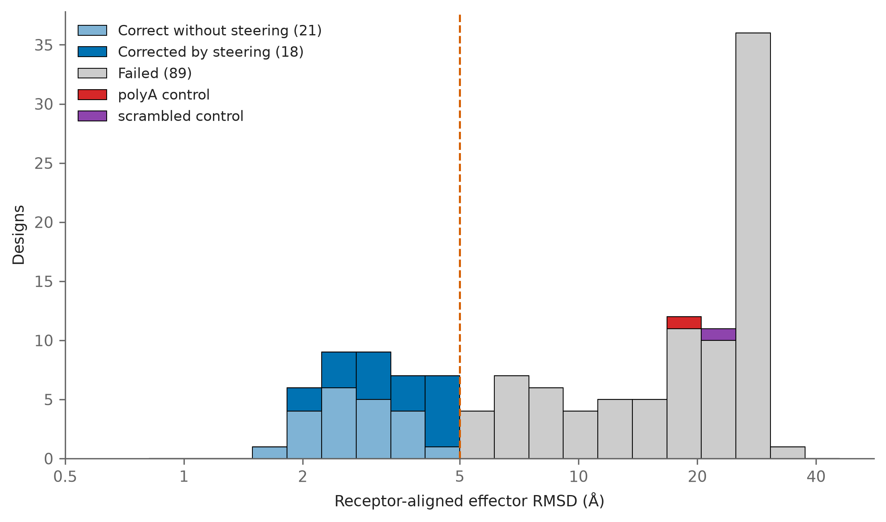

## The question

On natural Pik HMAs the benchmarking chapter found that Boltz-2 does not
mis-pose AVR-Pik effectors at random. Failures land on the AVR-Pia surface,
which is the fold's second real binding surface and the one over-represented in
the PDB. Negative steering was built on that finding, since one competing
surface can be targeted and diffuse error cannot.

The campaign receptors are resurfaced rather than natural, so the intended
interface is de novo and has no training precedent. Whether the same competing
surface attracts the failures has not been measured here, and the benchmark
cannot answer it.

The test is the benchmark's own. It is not which surface a pose overlaps more,
because the AVR-Pik surface is the larger of the two and the shared positions
are contacted either way. It is whether a pose contacts any AVR-Pia-**specific**
residue at all. In the benchmark, poses within 8 Å of the correct position
contacted none and every pose beyond 21 Å contacted some.

Two things had to match before the test would transfer.

* The pipeline reports design contacts as closest heavy atom within 5 Å. The
  reference surfaces are therefore defined the same way rather than on the
  benchmark's 8 Å Cα criterion, which otherwise makes correct poses look as
  though they touch AVR-Pia because the two definitions disagree.
* Three of the eleven AVR-Pia-only positions fall inside design region 1, which
  sits between the two surfaces. Alternating side chains on one strand face
  opposite ways, so a correctly posed effector contacts them anyway. Those three
  are excluded, leaving eight positions that are unambiguously AVR-Pia surface
  and untouched by the designer.

`interface_extract.py` writes `campaign_interface_check.csv` from committed
inputs, so this document renders without HPC access.

---

## Setup

```{python}
from pathlib import Path

import matplotlib.pyplot as plt
import numpy as np
import pandas as pd

HERE = Path.cwd()
if not (HERE / "campaign_interface_check.csv").exists():
    HERE = Path("experiments/campaigns/pikp1_avrpikf/analyses"
                "/campaign_interface_check")

df = pd.read_csv(HERE / "campaign_interface_check.csv")
print(f"{len(df)} designs")
```

---

## Before and after steering

```{python}
#| label: tbl-pia
#| tbl-cap: "Designs contacting at least one AVR-Pia-specific residue, split by whether the pose is within 5 Å of the intended one."
rows = []
for stage in ("cold", "steered"):
    for correct in (True, False):
        s = df[df[f"{stage}_correct"] == correct]
        rows.append({
            "stage": {"cold": "cold start",
                      "steered": "representative steered"}[stage],
            "pose": "correct" if correct else "incorrect",
            "n": len(s),
            "touching AVR-Pia": int(s[f"{stage}_touches_pia_specific"].sum()),
            "proportion": round(s[f"{stage}_touches_pia_specific"].mean(), 2),
            "median count": s[f"{stage}_n_pia_specific"].median()})
pd.DataFrame(rows)
```

```{python}
#| label: fig-bands
#| fig-cap: "Proportion of incorrectly posed designs contacting an AVR-Pia-specific residue, by how far the effector sits from its intended position."
BANDS = [(5, 10), (10, 21), (21, 1e9)]
LABELS = ["5-10 Å", "10-21 Å", ">21 Å"]
fig, ax = plt.subplots(figsize=(6.4, 4.2))
width = 0.38
for k, (stage, colour) in enumerate([("cold", "#999999"),
                                     ("steered", "#0072B2")]):
    bad = df[~df[f"{stage}_correct"].astype(bool)]
    y, n = [], []
    for lo, hi in BANDS:
        s = bad[(bad[f"{stage}_ra_eff"] >= lo) & (bad[f"{stage}_ra_eff"] < hi)]
        y.append(s[f"{stage}_touches_pia_specific"].mean() if len(s) else np.nan)
        n.append(len(s))
    x = np.arange(len(BANDS)) + (k - 0.5) * width
    ax.bar(x, y, width, color=colour, edgecolor="black", linewidth=0.6,
           label={"cold": "cold start", "steered": "after steering"}[stage])
    for xi, yi, ni in zip(x, y, n):
        if not np.isnan(yi):
            ax.text(xi, yi + 0.02, f"n={ni}", ha="center", fontsize=8)
ax.set_xticks(np.arange(len(BANDS)))
ax.set_xticklabels(LABELS)
ax.set_ylabel("proportion contacting AVR-Pia")
ax.set_xlabel("distance from the intended pose")
ax.set_ylim(0, 1.05)
ax.legend(frameon=True, fontsize=9)
fig.tight_layout()
plt.show()
```

---

## What this shows

* The benchmark pattern reproduces on de novo interfaces. At the cold start,
  89 of the 105 incorrectly posed designs contact an AVR-Pia-specific residue
  against 1 of the 23 correctly posed ones. Boltz-2 fails onto the same
  competing surface whether the intended interface is natural or designed.
* The distance relation holds too. Among incorrectly posed designs after
  steering, 0.15 contact AVR-Pia at 5-10 Å, 0.29 at 10-21 Å and 0.73 beyond
  21 Å. The benchmark saw none below 8 Å and all beyond 21 Å.
* Steering moves effectors off the competing surface even when it fails to land
  them. AVR-Pia-specific contact among incorrect poses falls from 89 of 105 to
  43 of 89, and the median count falls from 2 to 0. A design can therefore be
  repelled from AVR-Pia without arriving at the intended interface, which the
  pass count alone does not show.
* This is the premise negative steering needs. The competing surface is a
  discrete target on these receptors rather than diffuse error, so mutating it
  is the right intervention.

Caveats.

* Three AVR-Pia-only positions are excluded because they lie inside design
  region 1. The test is therefore run on 8 of the 11 AVR-Pia-only positions,
  and a pose contacting only the excluded three is scored as not touching
  AVR-Pia.
* The reference AVR-Pia surface comes from 6Q76, a wild-type Pikp-1 HMA, mapped
  onto the campaign frame by sequence alignment. The designed receptors do not
  have that surface intact, so the set marks where it used to be.
* Contacts are the pipeline's majority-over-seeds set for the representative
  design, so a design whose seeds disagree is represented by whichever contacts
  most seeds share.
* Cold-start and steered rows are the same 128 designs, so the two stages are
  paired, but the incorrect groups differ in size because steering moved 20 of
  them across the threshold.
* One campaign against one effector. The two sequence controls are excluded
  because they carry no corrected receptor.


## Distribution of post-steering pose error

`make_ra_eff_distribution.py` builds the other thesis figure for this section:
every one of the 128 designed sequences binned by its receptor-aligned effector
RMSD, stacked by the route it took to that outcome, with the polyA and
scrambled sequence controls stacked alongside. It was split out of the campaign
metric figures so that it sits with the rest of the negative-steering results.

{width="100%"}

- Designs whose initial Boltz-2 prediction was already correct are separated
  from those steering corrected, so steering's contribution is not read off a
  set that excludes the designs it was never applied to.
- Both controls fail. They are one sequence each, so they indicate rather than
  establish that steering fails on sequences it should fail on.
