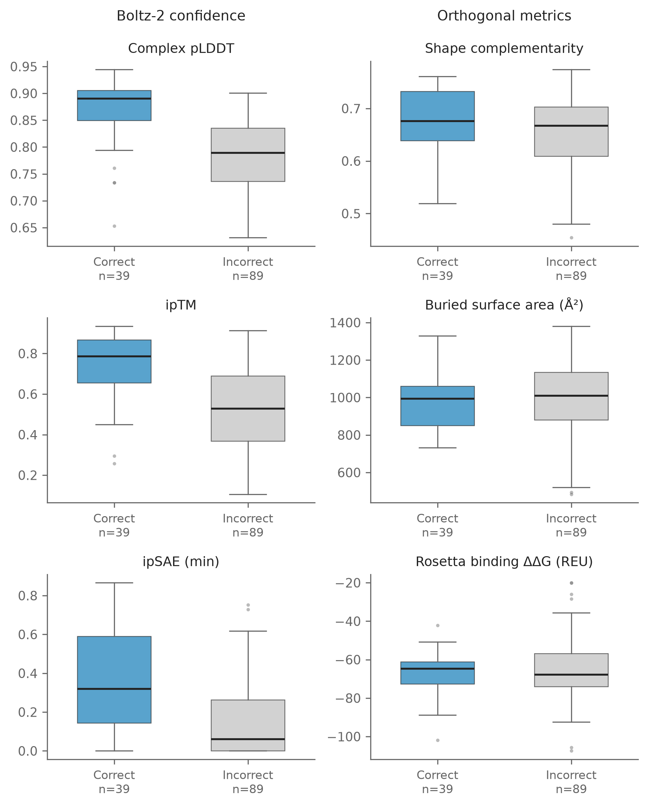
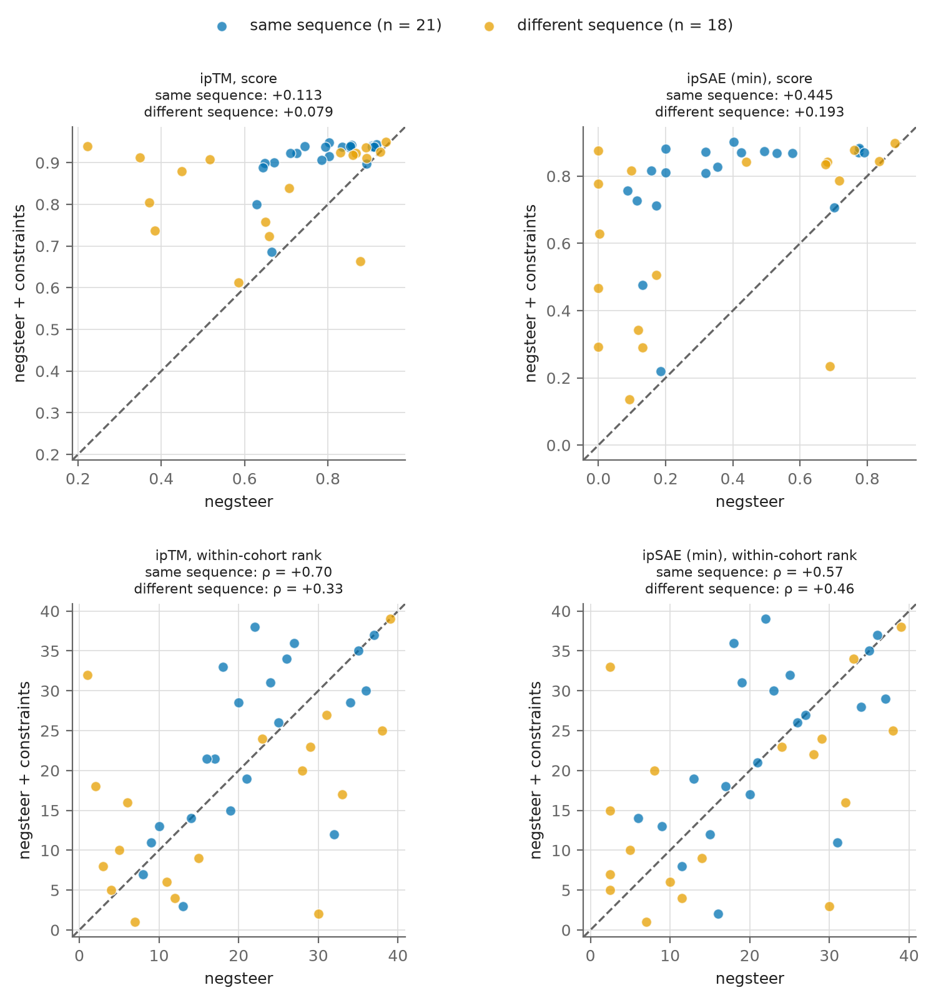

Date: 31/8/26

Boltz-2 reports its own confidence in a prediction. Shape complementarity,
buried surface area and Rosetta binding energy are computed from the structure
afterwards and know nothing about the predictor. This asks whether the two
families agree about which of the 128 designs are good.

Regenerate with:

```bash
cd analyses/06-confidence-and-biophysical-metrics
python3 make_figures.py
python3 rebuild_constraint_figure.py
```

## Confidence separates poses, the biophysical metrics do not

{width="100%"}

- Confidence separates correctly from incorrectly posed designs. Shape
  complementarity, buried surface area and Rosetta binding energy do not.
- Buried area and binding energy are marginally better for the incorrectly
  posed designs, so they cannot be used to rank designs on pose.

## What Boltz-2 constraints do to the metrics

Constraints were run as a diagnostic rather than a method variant, so this
figure is not in the results chapter. It is kept because it is the evidence
that constrained predictions cannot be ranked against unconstrained ones.

Migrated from `structure-negative-steering` `analysis/06-confidence-synthesis`,
campaign cohorts only. That document notes only 3 of the benchmark's 12
pose-matched targets have both arms on the same sequence, so the figure was
already campaign-only. The benchmark half stays in the benchmarking repository.

{width="100%"}

- 21 of the 39 pose-matched units have the same representative sequence in
  both arms, 18 do not.
- Constraints raise every metric level, so a constrained score cannot be
  compared against an unconstrained one.
