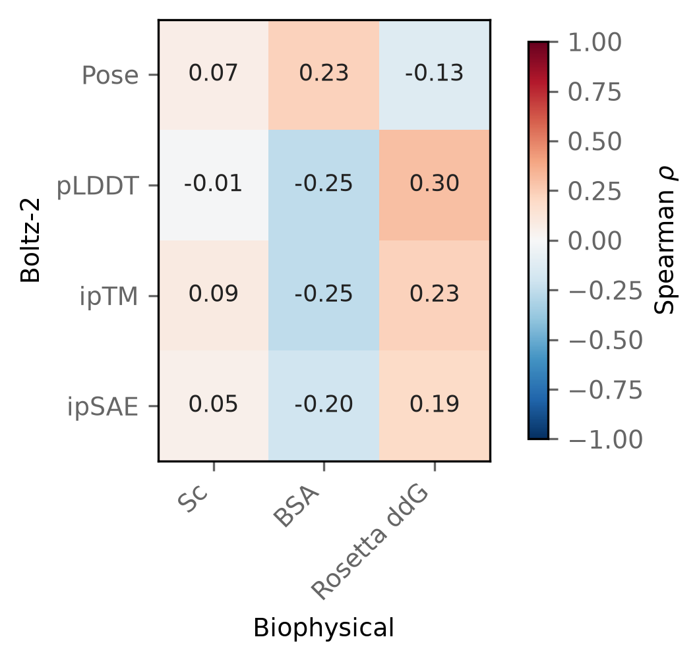
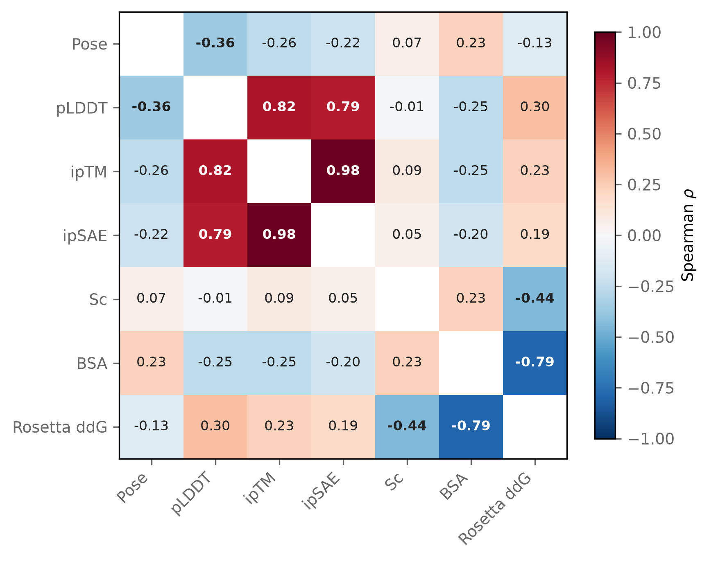
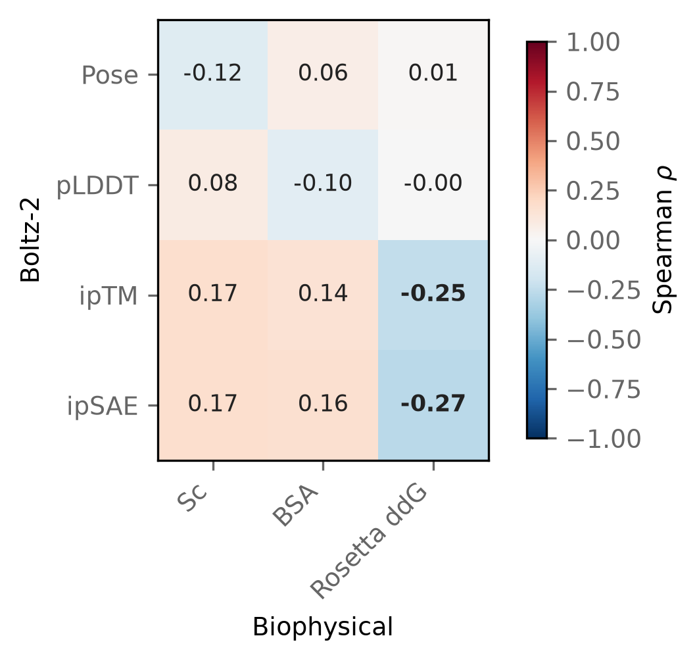
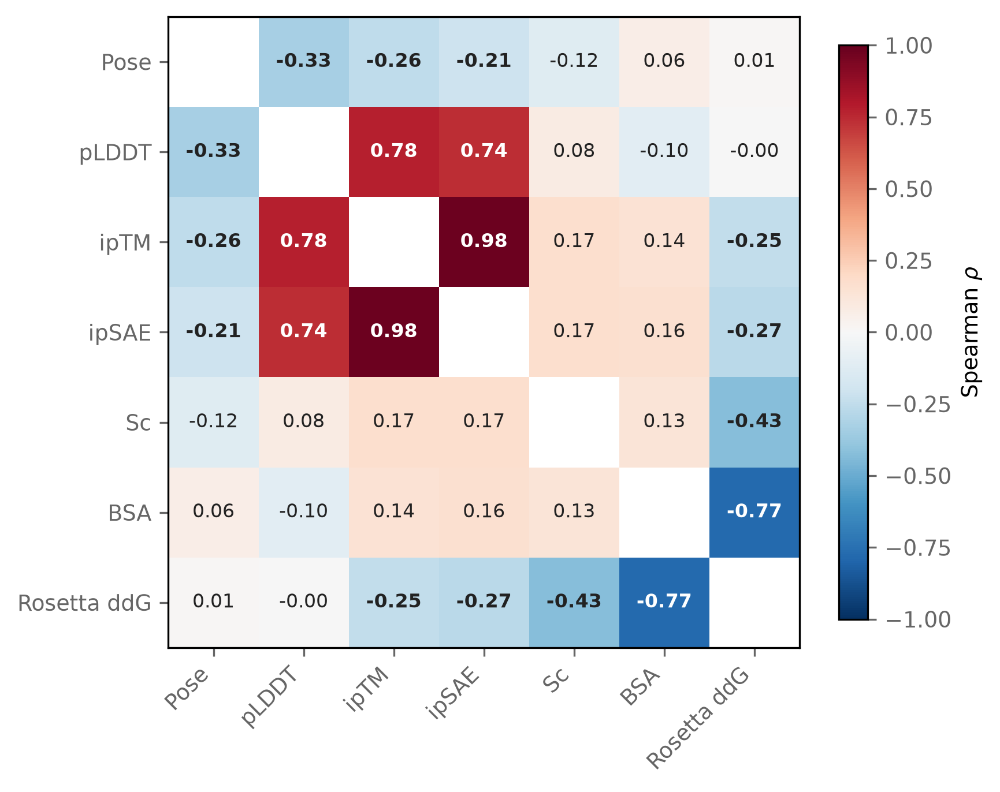

Date: 1/9/26

Overath et al. report that interface confidence and biophysical interface
descriptors complement each other when predicting binders, ipSAE outperforming
ipTM and improving further when combined with Rosetta ΔG/ΔSASA and shape
complementarity. That is the reason both families were computed here. Whether
they complement each other on these designs is a question about how they
covary, not about whether either separates a correct pose from an incorrect
one, so it needs a correlation rather than the threshold split in the results
chapter.

Regenerate with:

```bash
cd analyses/06-confidence-and-biophysical-metrics
python3 make_metric_correlations.py
```

Selection only ever chooses among the designs Boltz-2 posed correctly, so the
first matrix is restricted to those 39. The second covers all 128 for
comparison. Rosetta binding energy is favourable when negative and is left
unflipped, so its sign is opposite to the other two biophysical metrics.

## Correctly posed designs

```{python}
from pathlib import Path
import pandas as pd

HERE = Path.cwd()
if not (HERE / "metric_correlations.csv").exists():
    HERE = Path("analyses/06-confidence-and-biophysical-metrics")

pd.read_csv(HERE / "metric_correlations.csv", index_col=0)
```

{width="70%"}

The full matrix, including the within-family blocks:

{width="85%"}

- The two families are near-independent. Every confidence-against-biophysical
  correlation falls between −0.25 and 0.30, and none is significant at n = 39.
- Within each family the metrics are redundant. ipTM and ipSAE correlate at
  0.98, and buried surface area against Rosetta binding energy at −0.79.

## All designs

{width="70%"}

{width="85%"}

- Pooling both pose groups makes several confidence-against-biophysical
  correlations significant, at −0.21 to −0.27. That is an artefact of mixing:
  confidence differs by pose and the biophysical metrics do not, so combining
  the groups induces association that is absent within either.
- pLDDT against receptor-aligned effector RMSD survives in both sets, at −0.36 and −0.33, so among
  correctly posed designs a lower RMSD still comes with slightly higher pLDDT.
