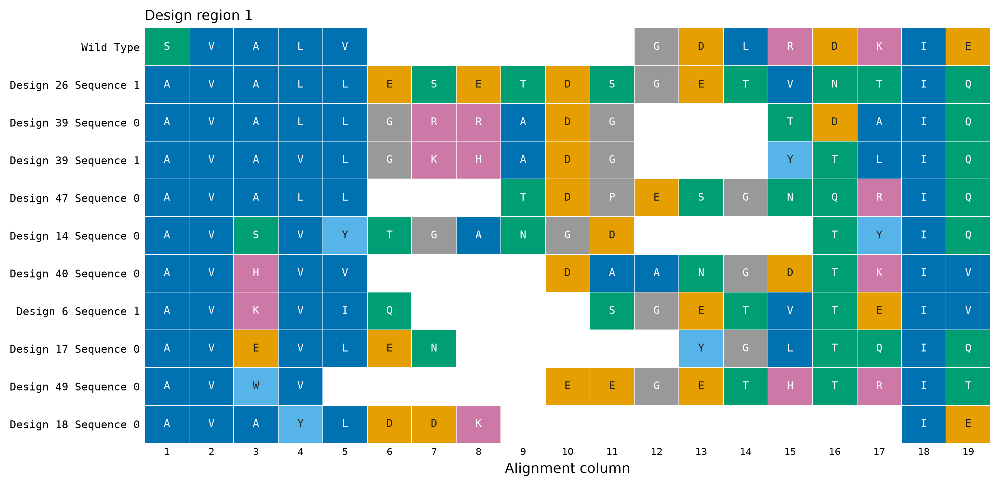
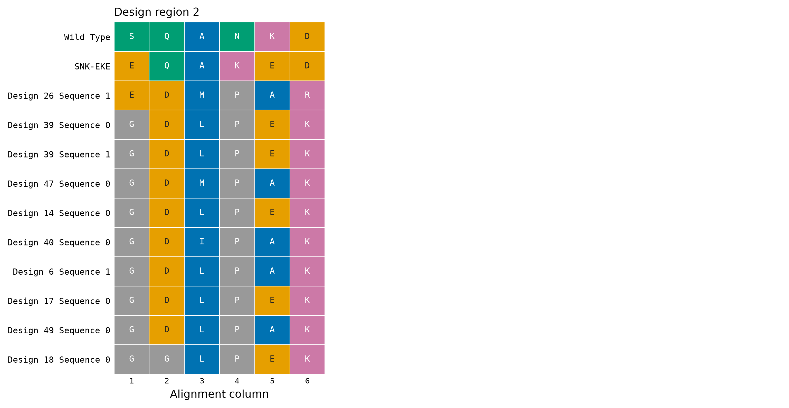
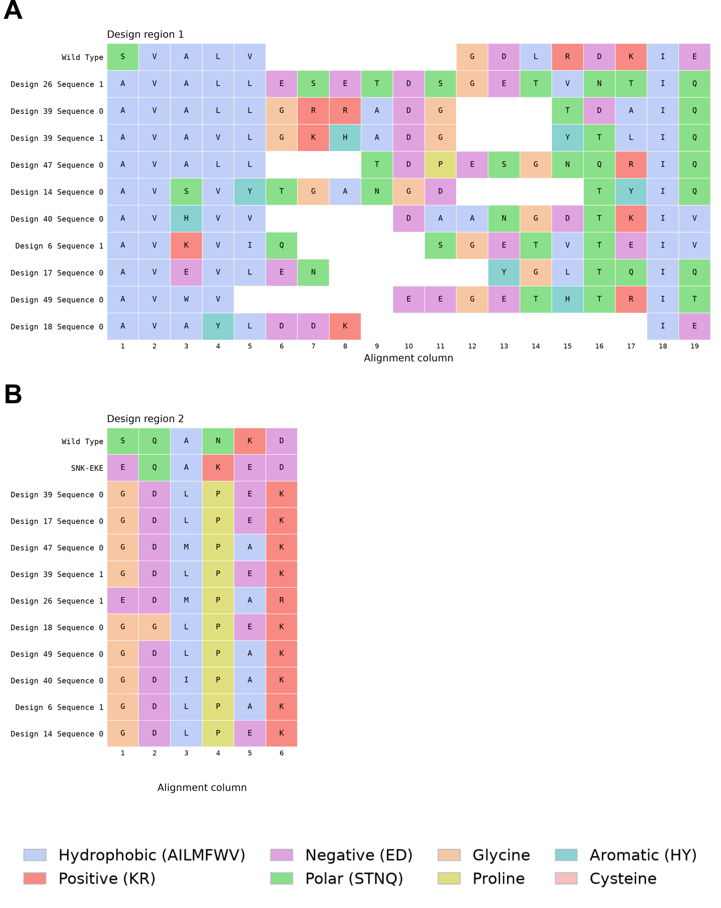

Date: 31/8/26

The ten sequences carried to agroinfiltration are aligned against the wild-type
Pikp-1 HMA, to show whether any of them recovered the wild-type residues or the
SNK-EKE pattern of the rationally engineered variant that recognises AVR-PikF.

Regenerate with:

```bash
cd analyses/07-design-region-msa
./rebuild_thesis_figure.sh
```

That runs `make_msa_plots.py` for the two panels and the colour key, then the
thesis assembler and Inkscape for the composite. The pipeline's own
`run_alignment.py` is cached in `data/` alongside the `.aln` files, but its
render is not used: it draws design region 1 pale and design region 2
saturated, and has no SNK-EKE reference row.

## Design region 1

{width="100%"}

- ClustalW puts every gap at the right-hand end, because terminal gaps are free
  in its model, which scatters the second β-strand across three columns. The
  region is realigned here against the longest design with end gaps penalised.
- Designs are ordered longest first, so a column compares loops of similar size.

## Design region 2

{width="100%"}

- A fixed six residues, taken from ClustalW unchanged, with the engineered
  SNK-EKE variant added as a second reference row.

## The assembled figure

{width="100%"}

- None of the ten recovers the wild-type sequence at either region, and none
  recovers the SNK-EKE pattern.
