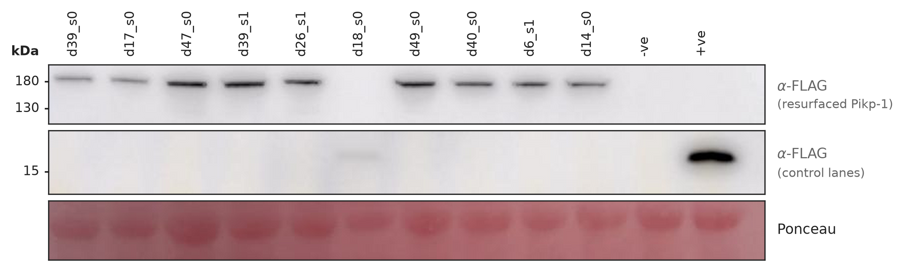
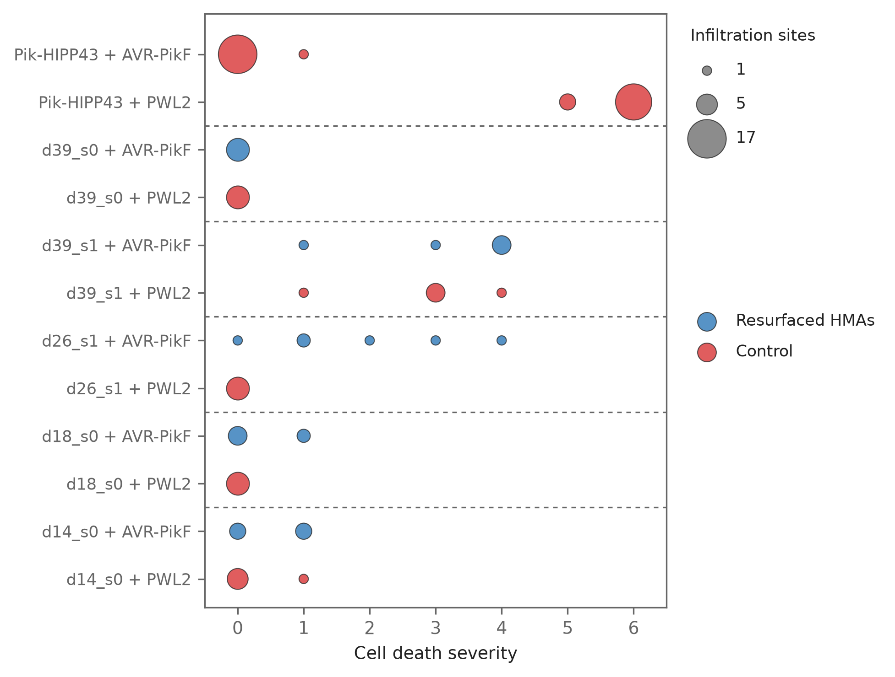
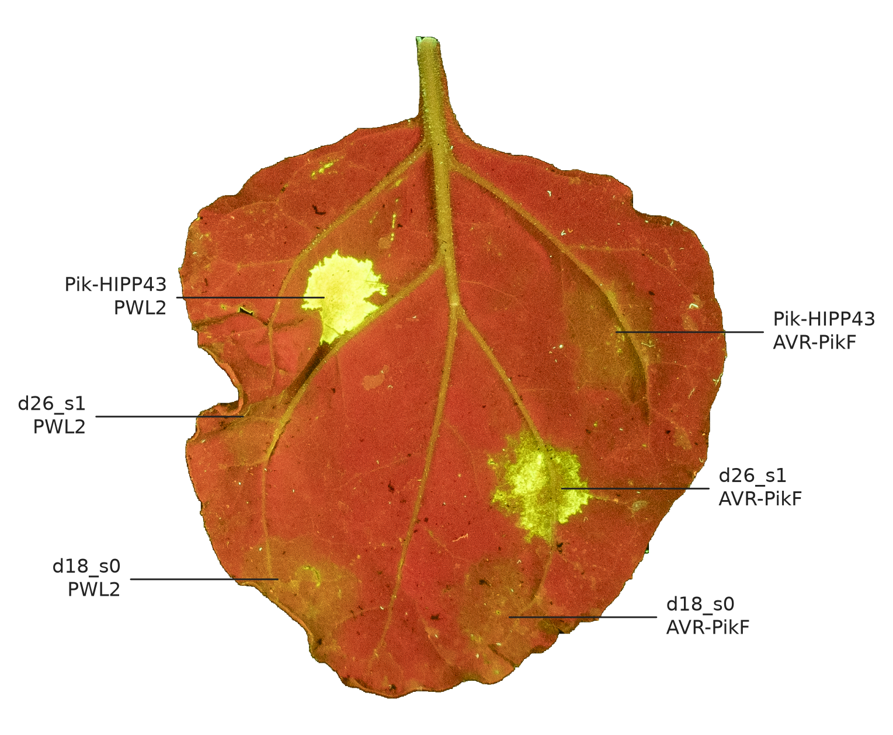

Date: 31/8/26

Ten resurfaced receptors were expressed in *Nicotiana benthamiana* and
co-infiltrated with AVR-PikF or with PWL2, an effector none of them is expected
to recognise. This covers expression, constitutive activity and recognition.

Regenerate with:

```bash
cd analyses/08-agroinfiltration
python3 make_blot_figure.py
python3 make_bubble_plot.py
python3 make_leaf_figures.py
```

The infiltration sheet and the UV leaf photographs are lab record rather than
analysis output, so both are read from
`runs/crystal_full_test_contig/agroinfiltrations/7dpi_5conditions/` rather than
duplicated here. `data/` holds only what this analysis produces or annotates:
the cell death scores, the design identifier map, the blot images and the
infiltration site map.

## Expression

{width="100%"}

- Nine of the ten expressed. No band is present for d18_s0.
- Lanes run in agroinfiltration order.

## Recognition

```{python}
# Reuses make_bubble_plot's own loader so the table and the figure cannot drift.
import os, sys
sys.path.insert(0, os.getcwd())
import make_bubble_plot as mbp

cond, scores = mbp.load()
(scores.merge(cond, on="treatment")
 .groupby(["design", "receptor", "effector"], dropna=False).score
 .agg(sites="count", median="median", max="max")
 .reset_index().sort_values("median", ascending=False))
```

{width="100%"}

- d26_s1 is the only design in the specific quadrant, at a median severity of
  1.5 with AVR-PikF against 0 with PWL2.
- d39_s1 reaches 4 with AVR-PikF but also 3 with PWL2, so it is autoactive
  rather than specific.

## The leaf

{width="100%"}

- Autofluorescence marks cell death. The image is `DSC_9957.tif`, background
  removed and each infiltration site labelled.
- This is the leaf showing the strongest d26_s1 response.
