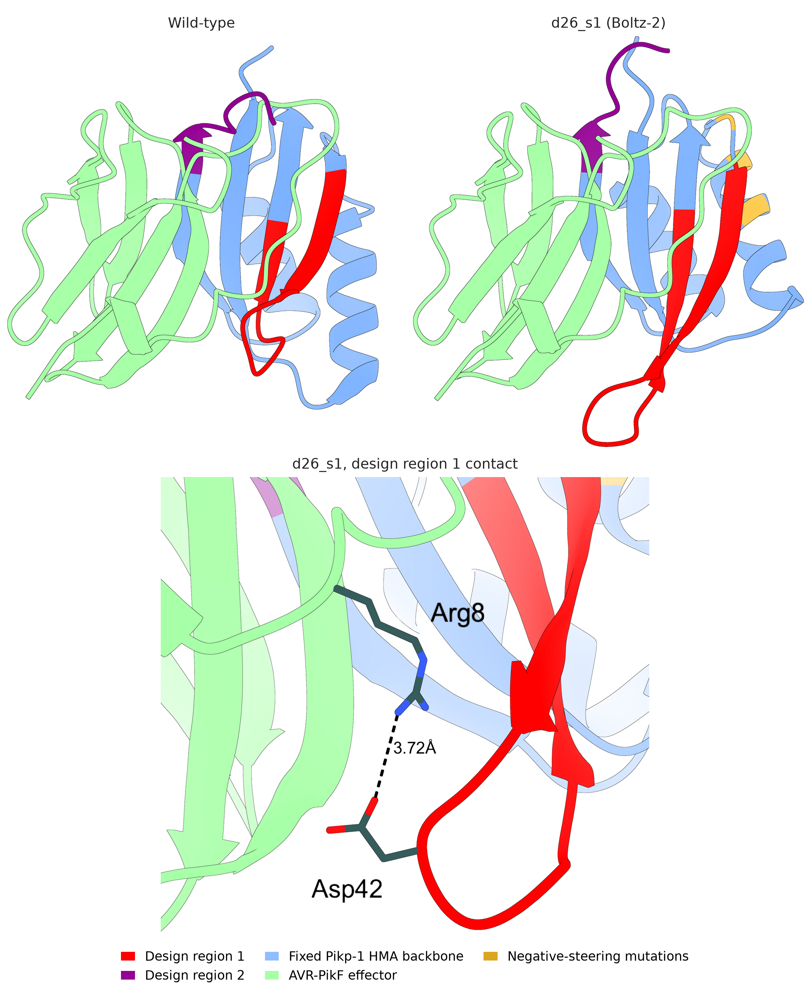
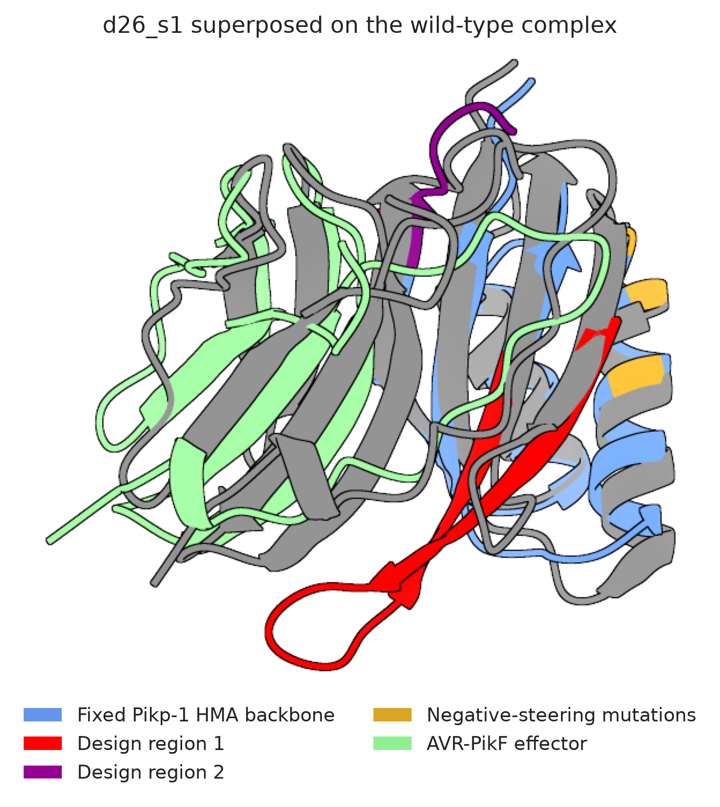

Date: 31/8/26

d26_s1 is the one design that gave a specific response to AVR-PikF. This
renders it beside the wild-type Pikp-1 HMA in the same orientation, to show
what its rebuilt design region 1 does.

Regenerate with:

```bash
cd analyses/09-wt-vs-design5
ChimeraX render_wt_vs_design5.cxc
python3 make_figure_options.py
```

ChimeraX cannot save images under `--nogui` on macOS, where it has no OpenGL
context, so the render step needs the GUI. The rendered panels are kept in
`renders/` so the figure can be rebuilt without re-rendering.

Both complexes are superimposed on the effector and rendered at one camera, so
the panels share a scale and any difference is a difference in the receptor.
`fix_sidechains.cxc` and `add_contacts.cxc` are applied before the final save.

## The thesis figure

{width="100%"}

- Design region 1 is rebuilt at 19 residues in d26_s1 against 13 in the wild
  type, and extends away from the domain body towards the effector.
- The dashed line marks the closest side-chain approach that extension makes,
  Asp42 carboxylate to the Arg8 guanidinium of AVR-PikF at 3.72 Å. This is
  proposed from the predicted structure and has not been tested.

## The alternative view

{width="80%"}

- Superposition makes the length difference easier to measure but loses the
  effector context that the side-by-side view keeps.
