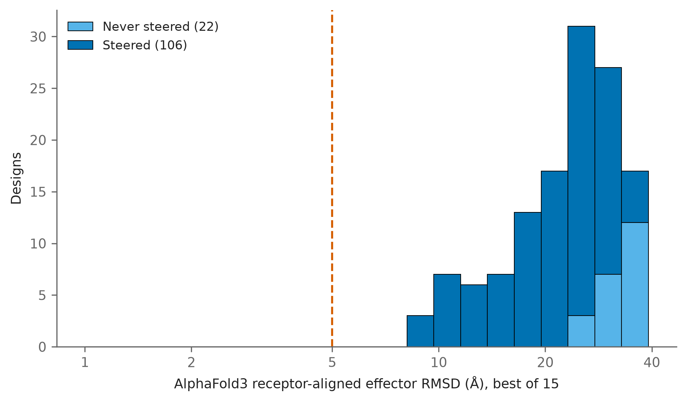
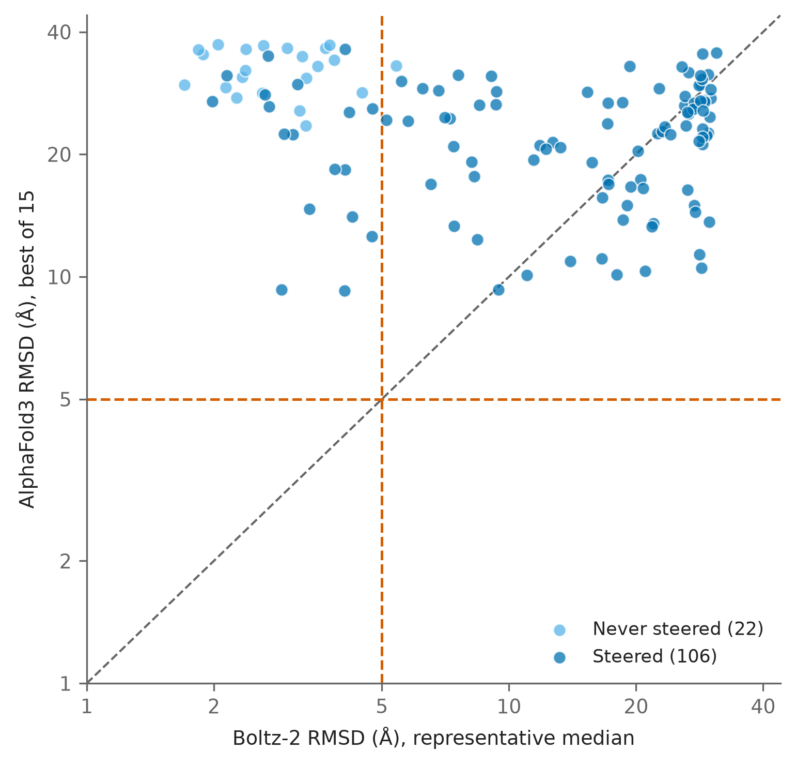

Date: 2/9/26

Boltz-2 posed a minority of the designed sequences correctly without steering.
This asks whether those sequences are inherently easy to pose, or whether the
placement is specific to Boltz-2.

The 22 units the pipeline left unsteered, its `cold_start_all_clean` set, were
re-predicted with AlphaFold3 without an MSA at seeds 42, 123 and 456. Note that
this set is not the same as the 21 sequences that were correctly posed at the
5 Å threshold: one unit was skipped by the 6 Å all-clean rule yet sits above
5 Å.

Regenerate with:

```bash
cd analyses/11-af3-unsteered-control
python3 generate_inputs.py            # writes inputs/ from the run tree
sbatch af3_unsteered.slurm.sh         # HPC array, one task per unit
python3 make_af3_figures.py
```

## AlphaFold3 posed none of them correctly

```{python}
#| echo: false
import pandas as pd
d = pd.read_csv("af3_unsteered_summary.csv")
print(f"units: {len(d)}")
print(f"best receptor-aligned effector RMSD: "
      f"min {d.af3_nomsa_best_ra_eff.min():.2f}, "
      f"median {d.af3_nomsa_best_ra_eff.median():.2f}, "
      f"max {d.af3_nomsa_best_ra_eff.max():.2f} A")
print(f"units under the 5 A threshold: {(d.af3_nomsa_best_ra_eff < 5).sum()}")
print(f"best ipTM: min {d.af3_nomsa_best_iptm.min():.2f}, "
      f"max {d.af3_nomsa_best_iptm.max():.2f}")
```

{width="100%"}

- No unit came within 23 Å of the intended pose, against a 5 Å threshold, so
  the disagreement is total rather than marginal.
- ipTM is low throughout, so AlphaFold3 is not confidently placing the effector
  somewhere else. It is not modelling the designed interface at all.

{width="100%"}

- The two models do not agree on any of the 22, so a sequence being easy for
  Boltz-2 to pose says nothing about whether AlphaFold3 will pose it.
- AlphaFold3 confidence therefore cannot serve as an orthogonal ranking signal
  for these designs, because it never models the interface being ranked.
