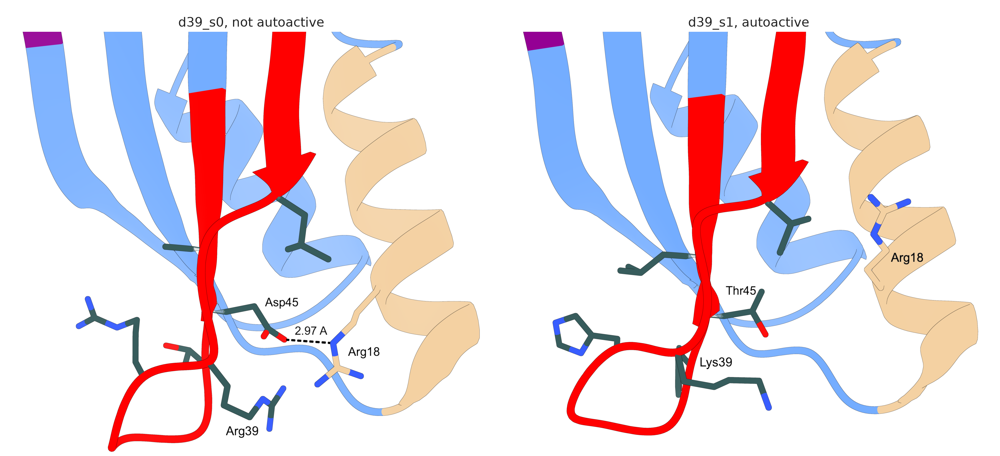

Date: 2/9/26

d39_s1 is autoactive, d39_s0 is flat, and both are ProteinMPNN sequences on the
same RFdiffusion backbone. Their design region 2 is identical, so every
difference is one of six substitutions in design region 1.

Structures used. Both are cold-start predictions, which carry no
negative-steering mutations, because the ordered constructs carried none
either. d39_s1's cold start places the effector wrongly, at 28.86 Å, but its
receptor is predicted well (independent receptor RMSD 0.904 Å) and the effector
is hidden throughout, so it is the right choice for a domain-only comparison.
Seed 1 is used as the median of its three seeds.

An earlier version of this analysis used d39_s1's reverted prediction, which
carries A26R and D32K. That showed helix A displaced by 2.41 Å, but A26R is the
last residue of helix A, so the shift was caused by the steering mutations and
not by the designed sequence. It is absent from all three cold-start seeds.

Regenerate with:

```bash
cd analyses/12-d39-sequence-pair
ChimeraX scene_for_positioning.cxc   # GUI: no OpenGL under --nogui on macOS
# position by hand, then: save positioned.cxs and write renders/
ChimeraX capture_positioned.cxc
python3 build_thesis_panels.py
python3 environment_of_differences.py
```

## The two structures are the same

Superposed on the receptor against the wild type:

| | helix A 14-26 | helix B 53-63 | whole scaffold |
|:--|--:|--:|--:|
| d39_s0 | 0.75 Å | 0.18 Å | 1.34 Å |
| d39_s1 | 0.81 Å | 0.41 Å | 1.64 Å |

- The two designs agree with each other to 0.71 Å over all 81 Cα, and helix A
  sits in the same place in both. The prediction offers no backbone signal that
  would mark d39_s1 as the autoactive one.
- d39_s1 is the less confident model throughout, mean pLDDT 88.3 against 92.9,
  so this is a comparison between two models of unequal confidence.

## Where the six differences point

```{python}
#| echo: false
import subprocess
print(subprocess.run(["python3", "environment_of_differences.py"],
                     capture_output=True, text=True).stdout)
```

- Two of the six face the effector, positions 40 and 46. The other four face
  back onto the domain body, so only those can perturb the domain itself.
- Only two helix A residues are contacted by those four at all, Arg18 and
  Met22. Met22 is engaged in both designs and unchanged.

## Arg18 loses both its partners

{width="100%"}

Closest approach from the Arg18 guanidinium:

| | partner | distance |
|:--|:--|--:|
| wild type | Asn15 OD1 | 2.98 Å |
| wild type | Leu40 O, Arg41 O (backbone) | 3.43, 3.42 Å |
| d39_s0 | Asp45 OD2 | 2.97 Å |
| d39_s0 | Arg39 NH2 | 2.68 Å |
| d39_s1 | Val36 CG2 | 3.43 Å |
| d39_s1 | nearest polar atom, Ser19 OG | 4.83 Å |

- In d39_s1 the guanidinium has no hydrogen-bond partner at all. Both of
  d39_s0's partners are substituted away, Asp45 to Thr45 and Arg39 to Lys39,
  and the side chain falls back against the hydrophobic face of its own helix.
- d39_s0 has its own oddity, two guanidinium nitrogens 2.68 Å apart, which is
  repulsive. Unusual geometry alone does not separate autoactive from flat.

## What this does not show

- These are independent Boltz-2 predictions, not one structure relaxing, and
  side-chain rotamers are the least reliable part of a predicted model. A
  charged side chain with nothing to bind is exactly where the predictor is
  guessing.
- One autoactive design, and only the HMA is modelled, so the surfaces that
  determine signalling with Pikp-2 are absent.
